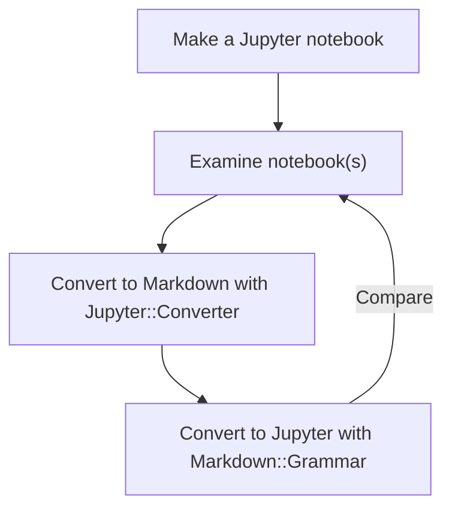

# Raku Jupyter::Converter

## In brief

Jupyter converters of Jupyter files into files of different kind of formats:

- [X] DONE HTML file
- [X] DONE Markdown file
- [X] DONE Mathematica notebook
- [X] DONE Org-mode file
- [X] DONE Pod6 file
- [X] DONE Raku data structure

### Related work

- The Raku package ["Markdown::Grammar"](https://raku.land/zef:antononcube/Markdown::Grammar), [AAp1], has a similar mission for Markdown files (or strings.)
- [Pandoc](https://pandoc.org) attempts to be a universal converter, applicable for all couples of formats of this package.


------

## Installation

From Zef ecosystem:

```
zef install Jupyter::Converter
```

From GitHub:

```
zef install https://github.com/antononcube/Raku-Jupyter-Converter.git
```

------

## Round trip translation

Consider the following round trip translation experiment:

1. Make a Jupyter notebook

2. Convert Jupyter notebook into Markdown file with the Raku package "Jupyter::Converter"

3. Convert the obtained Markdown file into Jupyter notebook using the Raku package "Markdown::Grammar"

4. Compare the notebooks


Here is the corresponding flowchart:



------

## Command line interface

The package provides a Command Line Interface (CLI) script, `from-jupyter`. Here is its usage message:

```shell
from-jupyter --help
```

The CLI script `from-jupyter` takes both file names and (Markdown) text. Here is an usage example for the latter:


**Remark:** If CLI script's argument `--output` is a non-empty string and `--to` is "whatever" or "automatic",
then an attempt is made to conclude the format to convert to from the extension of the file name given to `--output`.

The CLI (and `from-jupyter`) take a method option, which, if set to "delegation" converts the Jupyter notebook 
to Markdown text and then uses `from-markdown` of "Markdown::Grammar", [AAp1].

More elaborated conversions can be done with shell pipelines. For example:

```
from-jupyter resources/demo.ipynb --to=markdown | from-markdown -r=RakuInputExecute | pbcopy
```

------

## TODOs

The most important items are placed first.

- [X] DONE Markdown: export SVG images into an image directory
  - And use the links to those images in the Markdown output.
- [X] DONE Delegate to "Grammar::Markdown" for conversion  
  - [X] DONE Simple delegation for Mathematica and Org-mode 
  - [X] DONE Have a method option in `from-jupyter`
  - [X] DONE Corresponding CLI changes
  - I am not sure how needed this functionality is, after I made `from-markdown` being able to take pipeline input.
    - See "Markdown::Grammar:ver<0.6.4>:auth<zef:antononcube>:api<1>"
- [ ] TODO Compare package's HTML and POD6 converters outputs to those of "Markdown::Grammar"

------

## References

### Articles

[AA1] Anton Antonov,
["Notebook transformations"](https://rakuforprediction.wordpress.com/2024/02/17/notebook-transformations/),
(2024),
[RakuForPrediction at WordPress](https://rakuforprediction.wordpress.com).

### Guides

[JG1] John Gruber, [Markdown: Syntax](https://daringfireball.net/projects/markdown/).

[MC1] Matt Cone, [Markdown Guide](https://www.markdownguide.org).

[RC1] Raku Community, [Raku Pod6](https://docs.raku.org/language/pod).

### Packages

[AAp1] Anton Antonov,
[Markdown::Grammar, Raku package](https://github.com/antononcube/Raku-Markdown-Grammar),
(2022-2025),
[GitHub/antononcube](https://github.com/antononcube).


### Videos

[AAv1] Anton Antonov,
["Markdown to Mathematica converter (CLI and StackExchange examples)"](https://www.youtube.com/watch?v=39ekokgnoqE),
(2022),
[Anton A. Antonov's channel at YouTube](https://www.youtube.com/channel/UC5qMPIsJeztfARXWdIw3Xzw).

[AAv2] Anton Antonov,
["Markdown to Mathematica converter (Jupyter notebook example)"](https://www.youtube.com/watch?v=Htmiu3ZI05w),
(2022),
[Anton A. Antonov's channel at YouTube](https://www.youtube.com/channel/UC5qMPIsJeztfARXWdIw3Xzw).

[AAv3] Anton Antonov,
["Conversion and evaluation of Raku files"](https://www.youtube.com/watch?v=GJO7YqjGn6o),
(2022),
[Anton A. Antonov's channel at YouTube](https://www.youtube.com/channel/UC5qMPIsJeztfARXWdIw3Xzw).